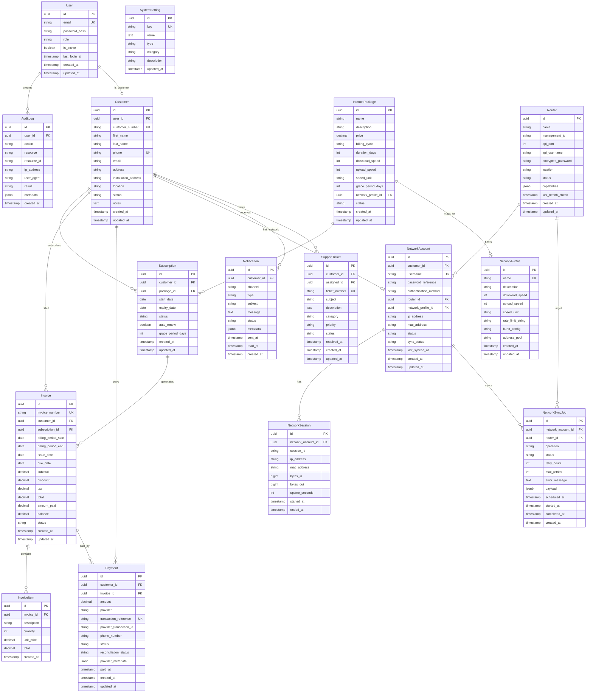

# Net-On — Entity Relationship Diagram (ERD)

## Complete Database ERD

```mermaid
erDiagram
    User ||--o{ AuditLog : "creates"
    User ||--o| Customer : "is_customer"
    User {
        uuid id PK
        string email UK
        string password_hash
        string role
        boolean is_active
        timestamp last_login_at
        timestamp created_at
        timestamp updated_at
    }

    Customer ||--o{ Subscription : "subscribes"
    Customer ||--o{ Invoice : "billed"
    Customer ||--o{ Payment : "pays"
    Customer ||--o| NetworkAccount : "has_network"
    Customer ||--o{ Notification : "receives"
    Customer ||--o{ SupportTicket : "raises"
    Customer {
        uuid id PK
        uuid user_id FK
        string customer_number UK
        string first_name
        string last_name
        string phone UK
        string email
        string address
        string installation_address
        string location
        string status
        text notes
        timestamp created_at
        timestamp updated_at
    }

    InternetPackage ||--o{ Subscription : "selected_for"
    InternetPackage ||--o| NetworkProfile : "maps_to"
    InternetPackage {
        uuid id PK
        string name
        string description
        decimal price
        string billing_cycle
        int duration_days
        int download_speed
        int upload_speed
        string speed_unit
        int grace_period_days
        uuid network_profile_id FK
        string status
        timestamp created_at
        timestamp updated_at
    }

    NetworkProfile {
        uuid id PK
        string name UK
        string description
        int download_speed
        int upload_speed
        string speed_unit
        string rate_limit_string
        string burst_config
        string address_pool
        timestamp created_at
        timestamp updated_at
    }

    Subscription ||--o{ Invoice : "generates"
    Subscription {
        uuid id PK
        uuid customer_id FK
        uuid package_id FK
        date start_date
        date expiry_date
        string status
        boolean auto_renew
        int grace_period_days
        timestamp created_at
        timestamp updated_at
    }

    Invoice ||--o{ InvoiceItem : "contains"
    Invoice ||--o{ Payment : "paid_by"
    Invoice {
        uuid id PK
        string invoice_number UK
        uuid customer_id FK
        uuid subscription_id FK
        date billing_period_start
        date billing_period_end
        date issue_date
        date due_date
        decimal subtotal
        decimal discount
        decimal tax
        decimal total
        decimal amount_paid
        decimal balance
        string status
        timestamp created_at
        timestamp updated_at
    }

    InvoiceItem {
        uuid id PK
        uuid invoice_id FK
        string description
        int quantity
        decimal unit_price
        decimal total
        timestamp created_at
    }

    Payment {
        uuid id PK
        uuid customer_id FK
        uuid invoice_id FK
        decimal amount
        string provider
        string transaction_reference UK
        string provider_transaction_id
        string phone_number
        string status
        string reconciliation_status
        jsonb provider_metadata
        timestamp paid_at
        timestamp created_at
        timestamp updated_at
    }

    Router ||--o{ NetworkAccount : "hosts"
    Router ||--o{ NetworkSyncJob : "target"
    Router {
        uuid id PK
        string name
        string management_ip
        int api_port
        string api_username
        string encrypted_password
        string location
        string status
        jsonb capabilities
        timestamp last_health_check
        timestamp created_at
        timestamp updated_at
    }

    NetworkAccount ||--o{ NetworkSession : "has"
    NetworkAccount ||--o{ NetworkSyncJob : "syncs"
    NetworkAccount {
        uuid id PK
        uuid customer_id FK
        string username UK
        string password_reference
        string authentication_method
        uuid router_id FK
        uuid network_profile_id FK
        string ip_address
        string mac_address
        string status
        string sync_status
        timestamp last_synced_at
        timestamp created_at
        timestamp updated_at
    }

    NetworkSession {
        uuid id PK
        uuid network_account_id FK
        string session_id
        string ip_address
        string mac_address
        bigint bytes_in
        bigint bytes_out
        int uptime_seconds
        timestamp started_at
        timestamp ended_at
    }

    NetworkSyncJob {
        uuid id PK
        uuid network_account_id FK
        uuid router_id FK
        string operation
        string status
        int retry_count
        int max_retries
        text error_message
        jsonb payload
        timestamp scheduled_at
        timestamp started_at
        timestamp completed_at
        timestamp created_at
    }

    Notification {
        uuid id PK
        uuid customer_id FK
        string channel
        string type
        string subject
        text message
        string status
        jsonb metadata
        timestamp sent_at
        timestamp read_at
        timestamp created_at
    }

    SupportTicket {
        uuid id PK
        uuid customer_id FK
        uuid assigned_to FK
        string ticket_number UK
        string subject
        text description
        string category
        string priority
        string status
        timestamp resolved_at
        timestamp created_at
        timestamp updated_at
    }

    AuditLog {
        uuid id PK
        uuid user_id FK
        string action
        string resource
        string resource_id
        string ip_address
        string user_agent
        string result
        jsonb metadata
        timestamp created_at
    }

    SystemSetting {
        uuid id PK
        string key UK
        text value
        string type
        string category
        string description
        timestamp updated_at
    }
```
